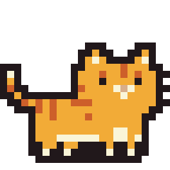
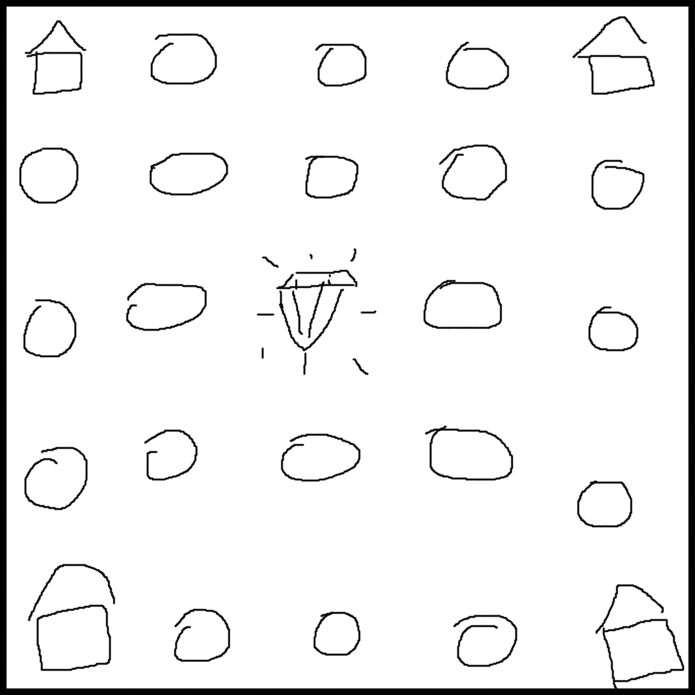
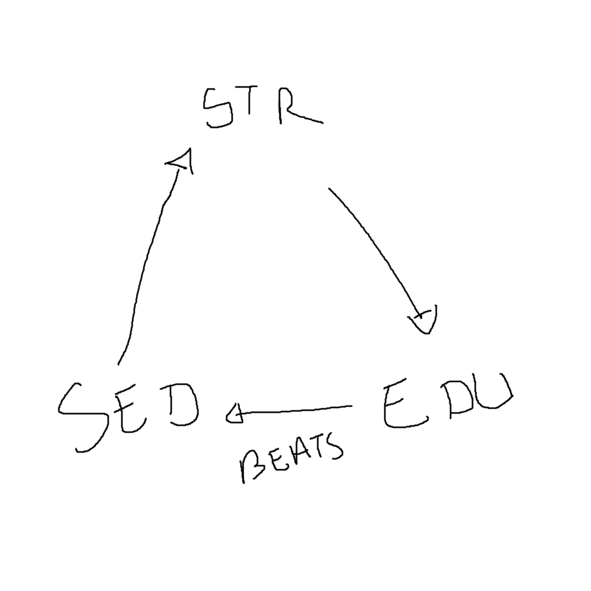
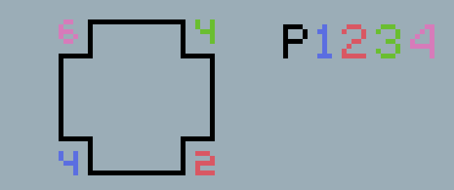

# Board Game Project

## Defence of the Cats [DOTC]

---

# Presentation

You play as the cat whisperer, with your zaza magic, you can summon and control cats!

You and up to 3 other players contend for the role of Ultimate Cat Whisperer (UCW).

To do that, you must control the center of the board, which contains the <u>MAGICAL CAT JEWEL OF DOOM</u>.

---

# Board

- You start at the houses in the corner

- You can control spots in the map

- Goal is to control the Jewel

---

# Resources

Loose definitions

##### Cats

 - Scaling Resource
 - you start with 1 cat
 - you get more cats as turns go
 - Cats have attributes (STR - SED - ACT)
 

---

##### Cat attributes

 - STR = Strenght
 - SED = Seduction
 - ACT = Self-Actualisation

---

##### Whisk-oohs

 - Accumulating resource
 - Override Attributes when used

##### Food cans

 - Scaling resource
 - Used to move cats from one place to another
 - limits turn lenghts
 - Add 1 every turn 

---

##### Board positions

 - HOT Fixed Shared Resource
 - Can be controlled by a player
 - when they have a certain number of cats in neighbouring cells
 - can be attacked by another player, then a duel starts
 - generate 1 whisk-oohs every turn for the controlling player

---

##### Board cell example

Each cell shows 4 numbers: one for each player.
The number represents how many cats are needed by each player to control each cell.
The closer the cell is to another player, the harder it is to control.

---

# Player Interactions

#### Direct attack : DUEL (1/2)

 - Attack another player's controlled cell
 - You can attack with any number of cats in neighbouring cells that YOU control, you must have at least the amount needed to control said cell. (always more than the owner needs)
 - The opponent defends his position with the cats in the attacked cell.
 - Whisk-oohs can be used by the players to override cat attributes, unless both use them ...

---

#### DUEL (2/2)

 - The defending player may chose to move cats from neighboring cells (by deducting CFC from their next turn).
 - The attacking player can attack from any neighboring cell at once.
 - When a cat is defeated, they are sent back to the home cell

---

#### Deduction

 - Judge the enemy's ability to defend a cell based on the cats they have, their whisk-oohs and the number of cats in neighbouring cells.

---

# Starting positions

 - Each player starts at a home tile.
 - Each player starts with a wizard card and 3 cat cards picked randomly.
 - Players start with 3 cat food cans per turn
 - The home tile generates 1 whisk-ooh per turn and can not be controlled by other players.
 - The playing order is arbitrary.

---

# Gameplay loop

 - One by one, the players have to spend all their cat food cans (CFC) for the turn or forfeit them.
 - They can accomplish one of the following actions:
   1. Send a cat back home (free)
   2. Move a cat to an neighbouring cell (1 CFC)
      - when they have enough cats in the cell, they can raise a flag and own the cell. The cell indicates how many cats are needed, depending on the wizard
   3. Attack a neighbouring owned cell (1 CFC / cat)

---

# Victory condition

The winner must keep control of the final cell for two consecutive full turns.

---

# Tensions

## Fundamental tension:
 - Difficulty to maintain control of the final cell

## Secondary tensions:
 - Limited resources : Whisk-oohs and CFC
 - Player hostility around the center cell
 - Cell control restrictions : number of cats needed
