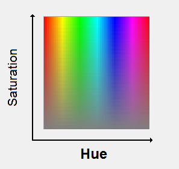

# **Game art**
## Pixel Art basics

[Pictures coming soon]

---

# What is pixel art

 - It's a form of art (duh!)
 - It's made of pixels!
 - Not all digital art is pixel art
 - Focus on control and precision
   Each pixel has a specific role in the artpiece.

---

# The (non-)importance of tools

 - Some tools are generally frowned upon: 
   - blurring, smudging, transparency ...
 - these tools generate new colors => less simplicity
 - Tools do not define what pixel art is, it's how they're used
 - Simple tools can go a long way

---

# Where to start

 - 8x8 canvas size
 - limited palette
   - can be taken from the internet
   - original gameboy palette
 - Aseprite (or MS paint, Grafx)
 - save as PNG or GIF

---

# Techniques used to form the image

 1. Start with line work, then fill in the color.

 2. block-in the major forms with large brush, then
    refine the image gradually.

---

# Some important techniques

 - [AA: Anti-Aliasing](#anti-aliasing)
 - [Dithering](#dithering)
 - [Pixel clustering](#pixel-clusters)

---

# Anti Aliasing

 - Making jagged edges look smoth
 - By hand-placing pixels of a different color to ease the
   transition from the background to the foreground
 - These pixels are buffers

---

# Dithering

 - Patterns of pixels used to ease the transition between pixels
 - Most used form is checkboard pattern or 50/50
 - there are other patterns:
   - stylized dithering: adding shapes to the pattern
   - Interlaced dithering: interlacing two dithers (3 colors)
     => color gradient
   - Random dithering: self-explanatory, generally to avoid

---

# Pixel clusters

Pixels aren't usually found alone, they exist in <u>clusters of the same color</u> or else they read as noise in the image.
=> Individual pixels are not independant.

The placement of pixels has a high impact of the end shape of the cluster and by extension, the clusters that this cluster borders.

---

# What to avoid

 - [Bad AA](#bad-aa)
 - [Jaggies](#jaggies)
 - [Bad dithering](#bad-dithering)
 - [Banding](#banding)
 - [Pillow shading](#pillow-shading)
 - [Noise](#noise)
 - [Sel-Out](#sel-out)

---

# Bad AA

 - Avoid too much AA! it makes the image look blurred
 - Avoid too little AA! jagginess will remain if not enough AA is used.
 - Avoid AA banding cf [AA Banding](#banding)

---

# Jaggies

When pixels are out of place, they <u>interrupt the flow of a line</u>.
Also accurs with lack of AA or any bad pixel technique.
Usually happens during line work.
To fix:

 - Change the lenght of a line: often a line is too short or long

 - Apply AA if the line is already perfectly aligned ($n\cdot\frac{\pi}{8}$)

---

# Bad Dithering

Using too much dithering : if dithering covers a great part of the sprite, then add a new color.
Dithering should be <u>at the edge</u> of a field of pixels.
It creates unwanted texture in the image when overused.
Depends on the contrast of the colors we want to dither in between.

---

# Banding

 - When pixels line up along one or both axes of the grid.
 - Different types:
   - hugging: when a shape and its outline line up and reveal the grid
   - fat pixels: when lines of the same lenght are placed parallel with each other
   - skip-one banding: when there is a gap between two parallel lines
   - 45° banding: pixels of the same color lining up in a diagonal

---

# Pillow Shading

- Surrounding an area with incraesingly darker bands
- Think topology maps
- does not reflect true source of light
- often comes with banding 
- follows flat shapes != 3d shape of the object projected
- like projecting the object on a concave plane

---

# Noise

cf [Pixel Clusters](#pixel-clusters): Independant pixels do not convey information on their own, they need to be in clusters.
Noise is any such pixel that does not convey information, but disrupts the surface on which it is placed.
Single pixels reveal the size of the grid.

Single pixels can still be used as:
 - specular highlights: small bright highlights 
 - very small, important details (eg. eyes on a small sprite...)

---

# Sel-out

Sel-out = selective outlining = Broken outlines.
Anti-Aliasing an outline to the background color.
Badly broken outlines create Jaggies.
We want to darken the outline of a sprite so it can register well on any background.
The outline can be shaded, which is different from AA and doesn't create as many jaggies.
Sel out can work in some situations, eg. if you can ensure the background is always dark ...

---

# Creating a palette

 - [When to color?](#when-to-color)
 - [Color counts](#color-counts)
 - [Hue, Saturation, Value](#hue-saturation-value)
 - [Color ramps](#color-ramps)
 - [Hue shifting](#hue-shifting)

---

# When to color ?

#### Method 1
 - choose most essential colors
 - add colors and mix when needed to add more shades

#### Method 2
Relative value of colors is more important than hue (cf. [HSV](#hue-saturation-value))
 - Start in shades of grey
 - Add color later

---

# Color count

Logical reasons behind using limited palette:
 - Cohesion: Using less colors means using the same colors more frequently. The palette ties the piece together.

 - Control: Easier to manage. Easier to change a color across the piece <-> maintaining the value (cf. [HSV](#hue-saturation-value)) relationships between colors.

---

# Hue, Saturation, Value

 - [Hue](#hue)

 - [Saturation](#saturation)

 - [Value](#value)

---

# Hue

The identity of a color (blue, red ...)

"the degree to which a stimulus can be described as similar to or different from stimuli that are described as red, orange, yellow, green, blue, violet,"

The perceived hue of a color depends on its environment.

---

# Saturation

The intensity of a color.

The lower the saturation, the closer the image is to grey.

Using too high saturation can be bad!.

Using too low saturation can make a piece look more muted.

---

---

# Value

How dark or light a color is.

The higher it is, the closer we get to white.

we want to have a higher range of values in a given piece, to create contrast.

while value is a set number, it is also relative to the background an neighbouring colors.

lower valued colors look thicker.

---

# Color ramps

A color ramp is a group of colors that can be used together, arranged by value. A palette can have more than one ramp.

It is important to be aware of the color relationships of your palette.

mid tones (tones between shadows and highlights) can sometimes be used in multiple ramps.

having colors that do not fit in your ramp.s can lead to eyeburn: because of high saturation or a clashing hue.

---

# Hue shifting

Using a transition of hues in a color ramp.
Without it, we have a <u>straight ramp</u> (not necessarily bad).

Hue-shifting is used because straight ramps are usually boring and don't reflect the variety of hues we see in reality, and hue shifting can add subtle color contrast within a ramp.