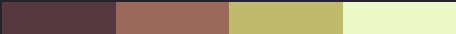

# **Game art**
## Pixel Art basics

---

# What is pixel art

 - It's a form of art (duh!)
 - It's made of pixels!
 - Not all digital art is pixel art
 - Focus on control and precision
   Each pixel has a specific role in the artpiece.

---

# The (non-)importance of tools

 - Some tools are generally frowned upon: 
   - blurring, smudging, transparency ...
 - these tools generate new colors => less simplicity
 - Tools do not define what pixel art is, it's how they're used
 - Simple tools can go a long way

---

# Where to start

 - 8x8 canvas size
 - limited palette
   - can be taken from the internet
   - original gameboy palette
 - Aseprite (or MS paint, Grafx)
 - save as PNG or GIF

---

# Techniques used to form the image

 1. Start with line art, then fill in the color.

 2. block-in the major forms with large brush, then
    refine the image gradually.

---

# Some important techniques

 - AA: Anti-Aliasing
 - Dithering
 - Pixel clustering

---

# Anti Aliasing

 - Making jagged edges look smoth
 - By hand-placing pixels of a different color to ease the
   transition from the background to the foreground
 - These pixels are buffers

---

# Dithering

---

# Pixel clusters

---

# What to avoid

 - Bad AA
 - Jaggies
 - Bad dithering
 - Banding
 - Pillow shading
 - Noise
 - Sel-Out

---

# Bad AA

 - Avoid too much AA! it makes the image look blurred
 - Avoid too little AA!

---

# Jaggies

---

# Bad Dithering

---

# Banding

 - When segments of AA line up with the lines they're buffering, AA banding occurs.

---

# Pillow Shading

---

# Noise

---

# Sel-out

---

# Creating a palette

[WIP]

