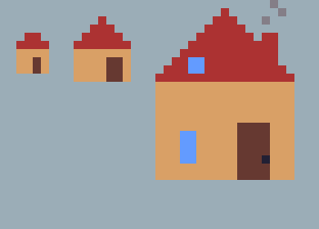

# Assignments

## Assignment 1 : Pixel art assets

### Guidelines

- Start a 120px square canvas on a neutral background.
- Use an online word generator for simple words.
- Generate a simple word. (oven, shirt ...)
- Draw what the word represents as small as possible.

### Submission

1. tin

2. match

3. play and watch

4. bottle

5. oven

6. ghost

7. zipper

8. house

9. lamp

10. pot

